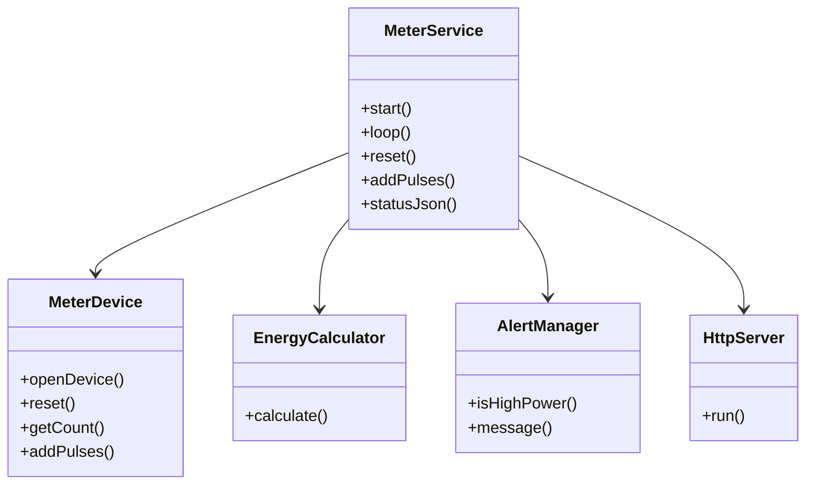

# Class Diagram

```mermaid
classDiagram
    class MeterDevice {
      +openDevice()
      +reset()
      +getCount()
      +addPulses()
    }
    class EnergyCalculator {
      +calculate()
    }
    class AlertManager {
      +isHighPower()
      +message()
    }
    class MeterService {
      +start()
      +loop()
      +reset()
      +addPulses()
      +statusJson()
    }
    class HttpServer {
      +run()
    }

    MeterService --> MeterDevice
    MeterService --> EnergyCalculator
    MeterService --> AlertManager
    MeterService --> HttpServer
```
