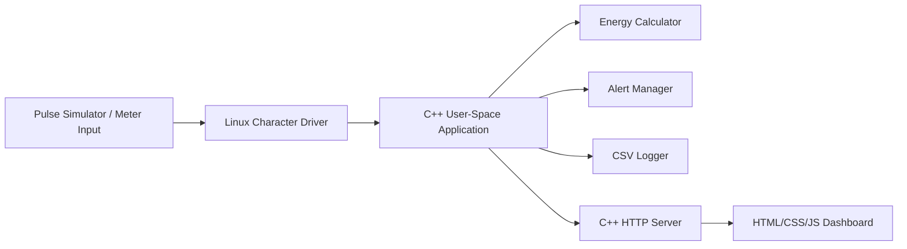

# Component Diagram

```mermaid
flowchart LR
    S[Pulse Simulator / Meter Input] --> D[Linux Character Driver]
    D --> U[C++ User-Space Application]
    U --> E[Energy Calculator]
    U --> A[Alert Manager]
    U --> L[CSV Logger]
    U --> H[C++ HTTP Server]
    H --> F[HTML/CSS/JS Dashboard]
```

The driver owns the protected pulse counter. The C++ process accesses it with
system calls and IOCTL. The application performs analytics and serves the
dashboard.
