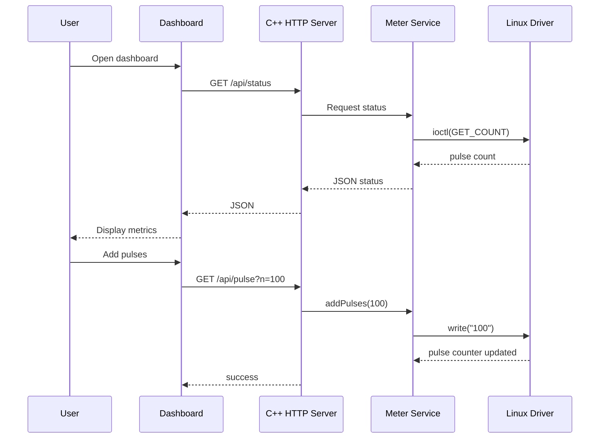

# Sequence Diagram

```mermaid
sequenceDiagram
    participant User
    participant Dashboard
    participant HTTP as C++ HTTP Server
    participant Service as Meter Service
    participant Driver as Linux Driver

    User->>Dashboard: Open dashboard
    Dashboard->>HTTP: GET /api/status
    HTTP->>Service: Request status
    Service->>Driver: ioctl(GET_COUNT)
    Driver-->>Service: pulse count
    Service-->>HTTP: JSON status
    HTTP-->>Dashboard: JSON
    Dashboard-->>User: Display metrics

    User->>Dashboard: Add pulses
    Dashboard->>HTTP: GET /api/pulse?n=100
    HTTP->>Service: addPulses(100)
    Service->>Driver: write("100")
    Driver-->>Service: pulse counter updated
    HTTP-->>Dashboard: success
```
