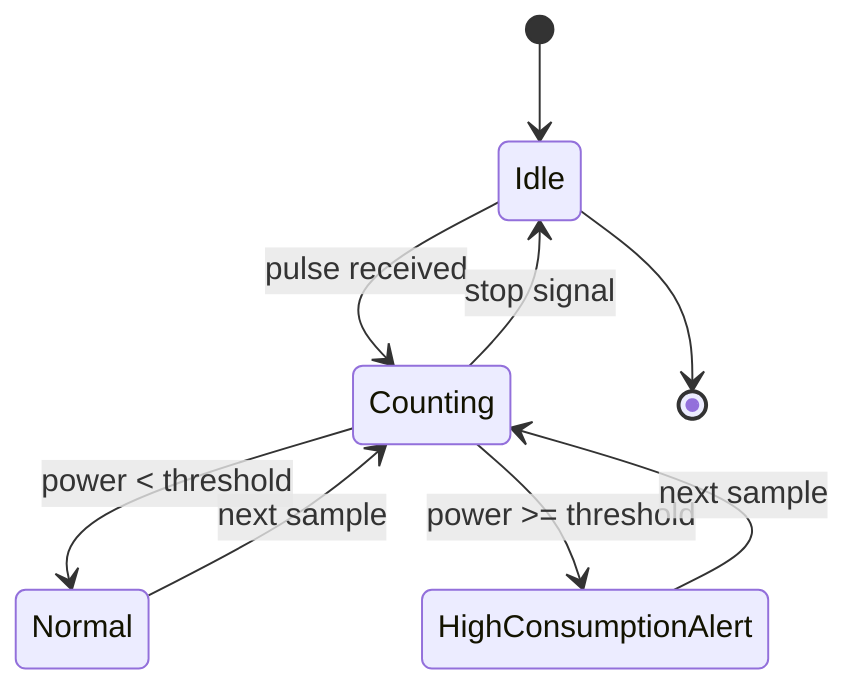

# State Machine

```mermaid
stateDiagram-v2
    [*] --> Idle
    Idle --> Counting: pulse received
    Counting --> Normal: power < threshold
    Counting --> HighConsumptionAlert: power >= threshold
    Normal --> Counting: next sample
    HighConsumptionAlert --> Counting: next sample
    Counting --> Idle: stop signal
    Idle --> [*]
```
